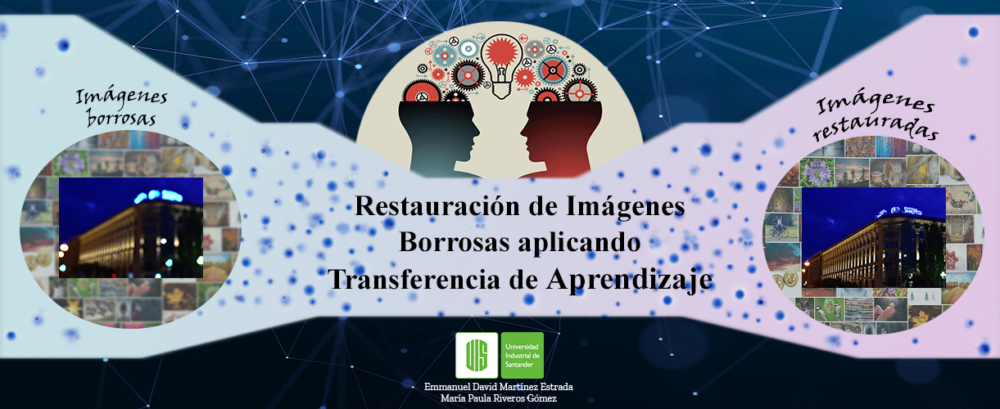

# Restauración de imágenes borrosas aplicando transferencia de aprendizaje

 

#### Integrantes

* Emmanuel David Martínez Estrada
* María Paula Riveros Gómez

#### Motivación
Actualmente existe una gran cantidad de información, en dónde parte de estos datos consisten en imágenes. Es común que las personas tomen muchas fotografias en las cuales, debido a factores externos, estas terminan viendose borrosas. Se propone recopilar un pequeño dataset de imágenes borrosas con el propósito de corregirlas mediante el uso de una red neuronal aplicando una técnica denominada Transferencia de Aprendizaje.

#### Objetivos
* Restaurar imagenes borrosas.
* Motivar el uso de transferencia de aprendizaje para la restauración de imagenes.
* Comparar diferentes CNNs contra la CNN propuesta.
